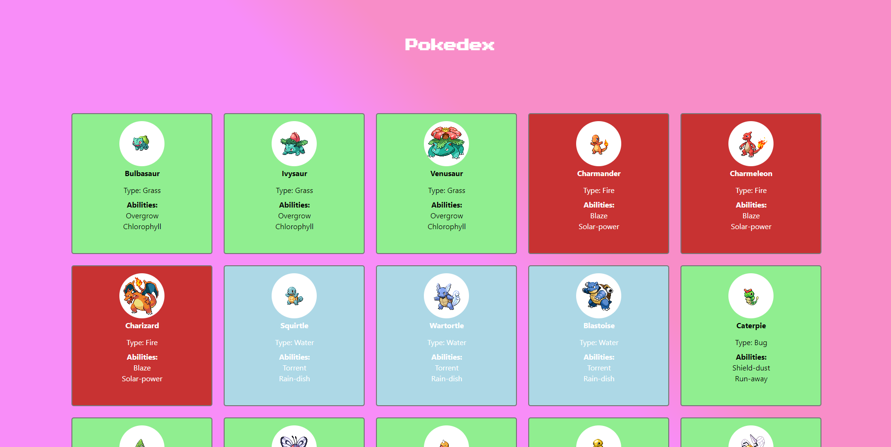

#Pokedex
# Pokedex

This is a simple Pokedex I have made on React. It's a very simple application utilizing PokeApi. The goal was to add Reactive style to the fetch, so the user could see a Loading screen while the page loads.

##Next Goals
## Next Goals

My next goal is to make a modal that provides more info on the pokemons, with sounds on each interation. I'll try to make it more like a 8-bit old school pokemon game in the future.

## How to access

- Make sure you have Node installed
- Create an empty folder in your PC
- Open Git BASH here
- Type 'git init' and press enter
- git clone https://github.com/richardrguinther/reactPokedex.git
- npm update and wait for it to install dependencies
- npm start